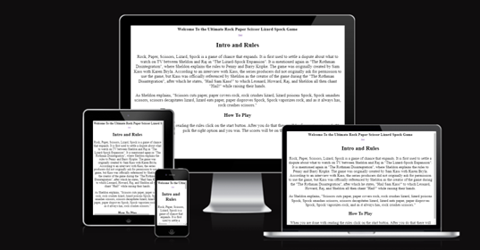

# Rock Paper Scissors Lizard Spock

This website is all about having fun by using JavaScript.  This website will be targeted to people who love Big Bang Theory and to people who love the original rock paper scissor game. This website is a fully responsive JavaScript game that allows users to pick options and see if you win or not. 
 
A live link can be found here:  https://jervisnoronha.github.io/-Rock-paper-scissor-spock-lizard/

## Features

GameArea
This section allows the users to play the game. The users will be able to click on the icons which are rock,paper,scissor,lizard and spock to play the game. 

PointsArea
This section shows you the points system when you win,lose or draw.

### Testing
HTML-No errors were found
CSS-No errors found
JS-

#### Credit
##### Content 
The Text from the home page was taken from: https://the-big-bang-theory.com/rock-paper-scissors-lizard-spock/
###### Photos
The images were taken from: (https://fontawesome.com/)

